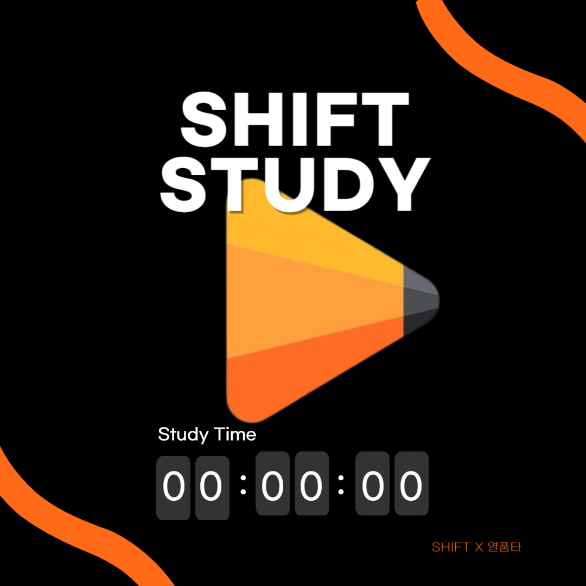
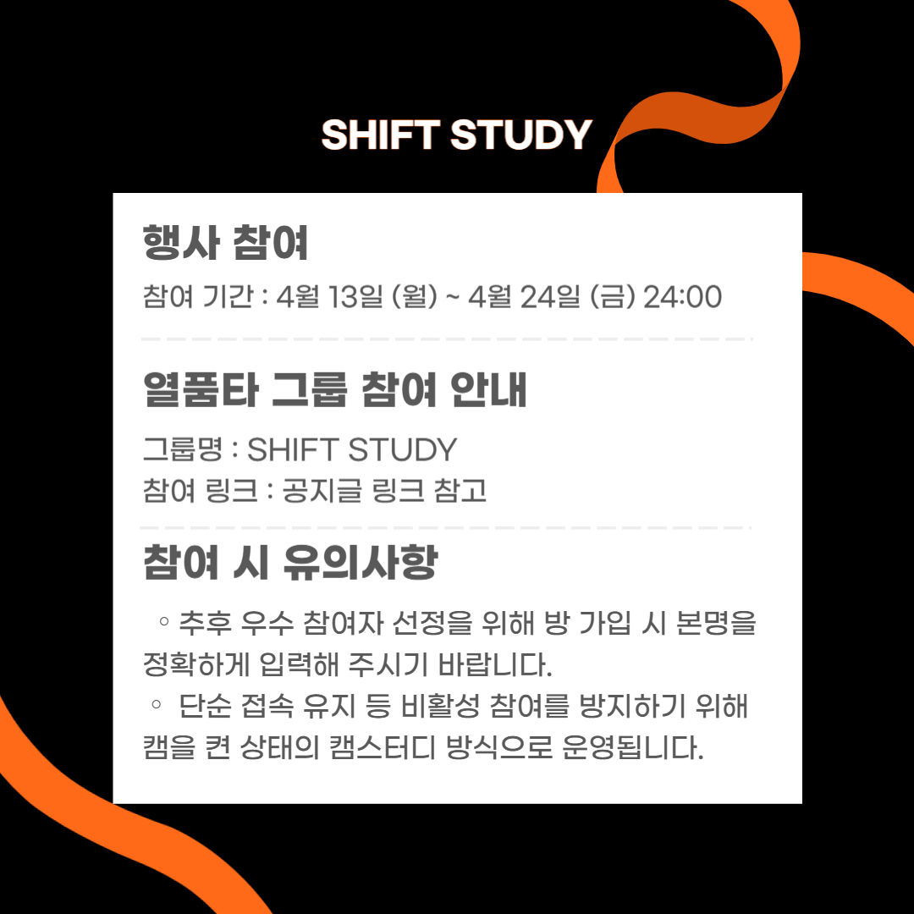
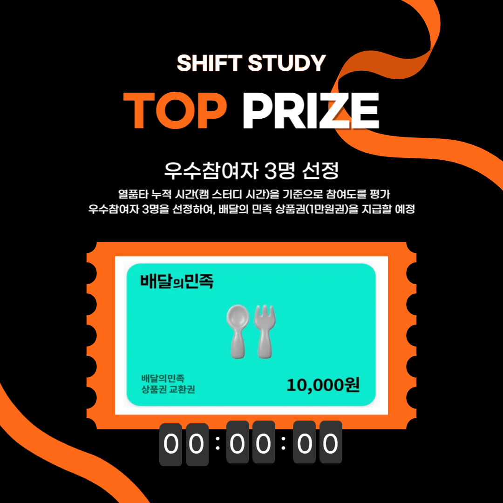

## 활동 개요

SHIFT 학술기획본부는 시험 기간 동안 학우들의 학습 몰입도를 높이고, 함께 공부하는 분위기를 만들기 위해 **열품타 스터디 윗 미 프로그램**을 운영했습니다.

:::{.callout-card}
SHIFT STUDY는 혼자 공부하는 시험 기간에도 서로의 공부 시간을 확인하며 학습 리듬을 유지하기 위한 캠스터디 기반 프로그램입니다.
:::

| 항목 | 내용 |
|---|---|
| 프로그램명 | SHIFT STUDY |
| 운영 기간 | 2026년 4월 13일 월요일 - 4월 24일 금요일 24:00 |
| 운영 방식 | 열품타 그룹 기반 캠스터디 |
| 그룹명 | SHIFT STUDY |
| 평가 기준 | 캠 인증 시간 |
| 보상 | 우수 참여자 3명 배달의민족 상품권 1만원, 참여자 커피 쿠폰 |

## 프로그램 안내

<h3>SHIFT STUDY</h3>

시험 기간 학습 몰입을 위한 스터디 윗 미 프로그램입니다.

<h3>행사 안내</h3>

함께 공부하는 분위기 형성과 학습 몰입도 향상을 목표로 운영했습니다.

<h3>참여 안내</h3>

열품타 그룹 <code>SHIFT STUDY</code>에 참여하고, 캠을 켠 상태의 캠스터디 방식으로 진행했습니다.

<h3>TOP PRIZE</h3>

캠 스터디 누적 시간을 기준으로 우수 참여자 3명을 선정했습니다.

## 참여 방식

- 열품타 그룹명: `SHIFT STUDY`
- 초대 링크를 통해 그룹 참여
- 우수 참여자 선정을 위해 방 가입 시 본명 입력
- 단순 접속 유지를 방지하기 위해 캠을 켠 상태로 참여
- 캠 스터디 시간을 기준으로 참여도 평가

## 최종 순위

시험 기간 동안 운영된 SHIFT STUDY 프로그램은 캠 인증 시간을 기준으로 최종 순위를 집계했습니다.

| 순위 | 이름 | 캠 인증 시간 |
|---|---|---|
| 1위 | 이형재 | 89시간 1분 26초 |
| 2위 | 박찬영 | 40시간 39분 44초 |
| 3위 | 이시우 | 40시간 24분 55초 |

선정된 우수 참여자 3명에게는 배달의민족 상품권 1만원권을 지급하기로 했습니다. 또한 프로그램에 참여해 캠 인증 기록이 있는 참여자 전원에게 학관 카페gee 커피 쿠폰을 전달하기로 했습니다.

## 운영 의의

SHIFT STUDY는 시험 기간에 각자 흩어져 공부하더라도, 같은 그룹 안에서 학습 시간을 기록하고 서로의 몰입을 확인할 수 있도록 만든 프로그램입니다. 단순한 이벤트보다 **학습 습관 형성, 참여 동기 부여, 커뮤니티 분위기 유지**에 초점을 두었습니다.

## 운영 메모

- 시험 기간 전 안내 이미지를 배포해 참여 방법을 명확히 안내했습니다.
- 평가 기준을 캠 인증 시간으로 통일해 순위 산정 기준을 분명히 했습니다.
- 참여자 전원 보상을 함께 준비해 순위권 외 참여자에게도 감사와 동기부여를 전달했습니다.
- 공개 사이트에는 개인정보가 포함된 문의 안내 이미지는 게시하지 않았습니다.
