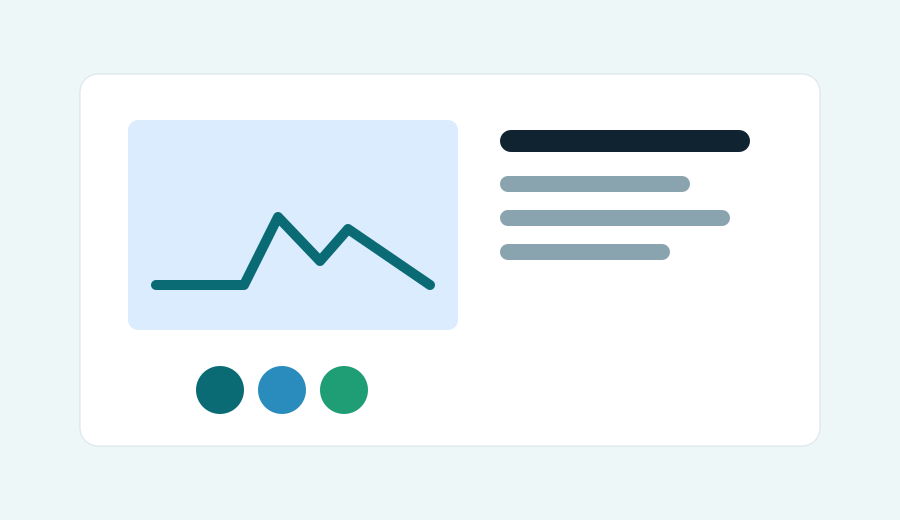
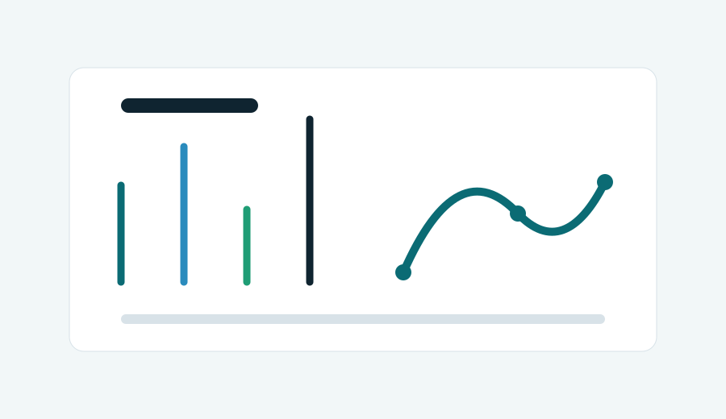

## 활동 갤러리

세미나, 워크숍, 프로젝트 발표, 팀 활동 사진을 모아두는 공간입니다. 실제 사진이 준비되면 아래 이미지를 교체해 사용하면 됩니다.

:::{.gallery-grid}

:::{.gallery-item}

### 정기 세미나

디지털헬스케어와 의료 AI 주제를 함께 읽고 발표합니다.
:::

:::{.gallery-item}

### 데이터 스터디

Python, R, SQL을 활용해 데이터 분석 기초를 다집니다.
:::

:::{.gallery-item}

### 프로젝트 발표

학기별 팀 프로젝트 결과를 공유하고 피드백을 받습니다.
:::

:::{.gallery-item}

### 팀 활동

스터디와 프로젝트를 통해 선후배가 함께 성장합니다.
:::

:::

## 사진 추가 방법

1. `assets/images/` 폴더에 사진을 추가합니다.
2. 이 페이지의 이미지 경로를 새 사진 파일명으로 바꿉니다.
3. 활동 이름과 설명을 함께 업데이트합니다.
