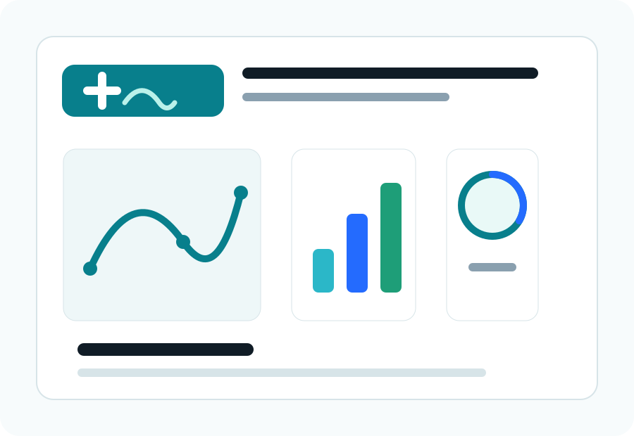

:::{.shift-hero}
:::{.hero-copy}

학과 디지털헬스케어 학술동아리

<h1>데이터로 건강을 읽고 기술로 서비스를 만듭니다.</h1>

DHC-SHIFT는 의료 데이터, AI, 소프트웨어, 서비스 기획을 함께 공부하고 학기별 프로젝트로 이어가는 학과 기반 커뮤니티입니다.

:::{.hero-actions}
[이번 학기 공지](announcements/index.qmd){.btn .btn-primary}
[활동 아카이브](activities/index.qmd){.btn .btn-soft}
:::
:::

:::{.hero-visual}

:::
:::

:::{.info-strip}
:::{.info-pill}
**정기모임**  
매주 수요일 15:00
:::

:::{.info-pill}
**활동 장소**  
학과 세미나실 / 온라인 병행
:::

:::{.info-pill}
**운영 방식**  
세미나, 스터디, 팀 프로젝트
:::
:::

## 이번 학기 활동

:::{.card-grid .three}

:::{.feature-card}
### 헬스케어 데이터 스터디
공개 데이터셋, 설문 데이터, 웨어러블 데이터를 다루며 전처리와 시각화의 기본기를 쌓습니다.
:::

:::{.feature-card}
### 의료 AI 세미나
논문과 사례를 읽고, 모델의 가능성과 한계를 학과 수준에서 함께 토론합니다.
:::

:::{.feature-card}
### 팀 프로젝트
문제 정의부터 프로토타입, 분석 리포트, 발표 자료까지 학기 말 산출물을 남깁니다.
:::

:::

## SHIFT 로드맵

:::{.roadmap}
:::{.road-step}
**01. Learn**  
기초 개념과 도구를 함께 익힙니다.
:::

:::{.road-step}
**02. Explore**  
헬스케어 문제와 데이터를 탐색합니다.
:::

:::{.road-step}
**03. Build**  
팀별 프로젝트를 설계하고 구현합니다.
:::

:::{.road-step}
**04. Share**  
결과를 발표하고 활동 기록으로 남깁니다.
:::
:::

## 빠른 이동

:::{.link-grid}
:::{.link-card}
### 공지
모집, 세미나, 제출 일정 안내

[확인하기](announcements/index.qmd)
:::

:::{.link-card}
### 일정
정기모임과 학기 주요 일정

[확인하기](events/index.qmd)
:::

:::{.link-card}
### IT 온보딩
연도별 온보딩 세션 기록과 준비 체크리스트

[확인하기](onboarding/index.qmd)
:::

:::{.link-card}
### 자료실
스터디 자료와 추천 학습 링크

[확인하기](resources.qmd)
:::
:::
