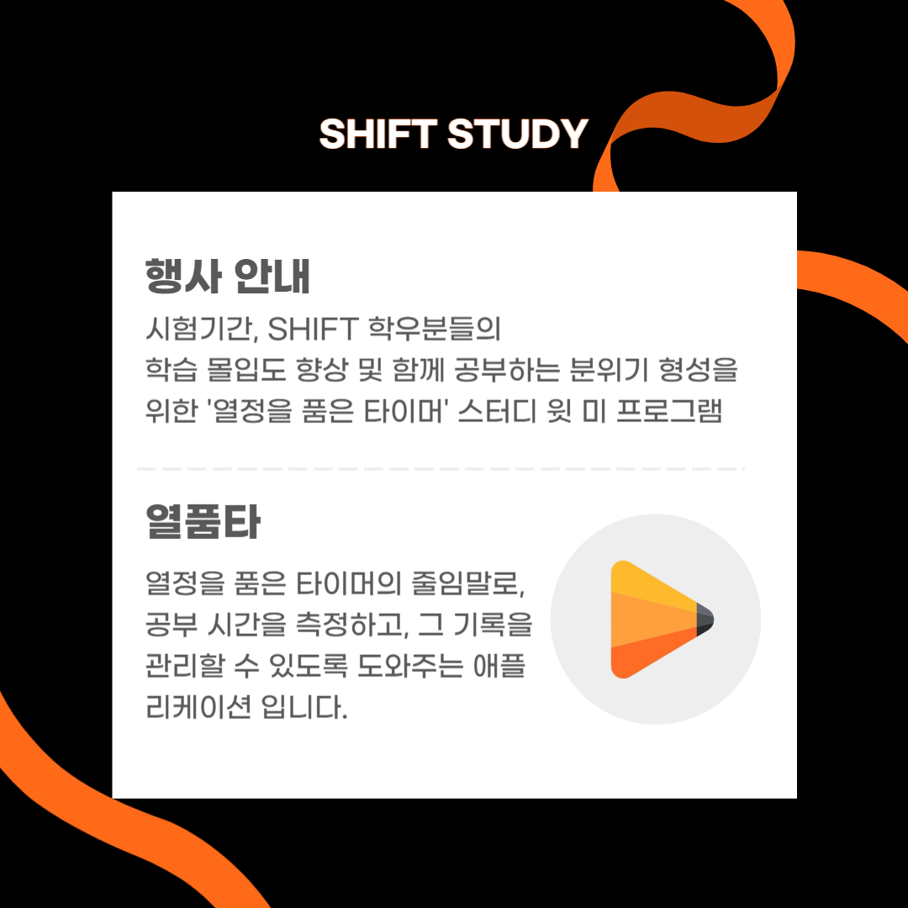

::: {.page-hero .compact-hero}
::: {.page-kicker}
What We Do
:::

# 무엇을 하는 곳인가

SHIFT는 디지털헬스케어를 주제로 기초 학습, 스터디, 프로젝트 활동을 운영합니다. 활동은 코딩 멘토링, 자율 스터디, IT 온보딩, 디지털헬스케어 산업지도 프로젝트를 중심으로 진행됩니다.
:::

::: {.line-panel .pdf-preview .compact-pdf}
<iframe src="SHITF_신입_부원_모집_홍보용.pdf" title="SHIFT 안내 PDF 미리보기" loading="lazy"></iframe>

<p class="pdf-mobile-note">모바일에서는 아래 새 창 보기 버튼으로 자료를 확인하는 것을 권장합니다.</p>

<div class="pdf-actions">
  <a class="shift-btn primary" href="https://skywork.live/share/v2/ppt/2050497824892456960?pid=2049443678168350720&sid=gen_ppt-TCXozif1V&t=gen_ppt&mode=102" target="_blank" rel="noopener">새 창으로 보기</a>
  <a class="shift-btn ghost" href="SHITF_신입_부원_모집_홍보용.pdf" download>PDF 다운로드</a>
</div>
:::

## 주요 활동

::: {.card-grid}
::: {.shift-card .accent-cyan}
### 코딩 과목 멘토링

코딩 과목을 함께 복습하고, 과제 풀이 방향과 실습 중 막히는 부분을 점검합니다.
:::

::: {.shift-card}
### 자율 스터디

기초 코딩, 어학, 논문 읽기 같은 핵심 소모임을 중심으로 운영하며, 구성원의 관심에 따라 자유주제 소모임도 개설할 수 있습니다.
:::

::: {.shift-card .accent-lime}
### IT 온보딩 세션

협업 도구, 문서화, 발표 준비, 프로젝트 운영에 필요한 기본 절차를 다룹니다. 구성원은 발표자 또는 참여자로 참여할 수 있습니다.
:::

::: {.shift-card}
### 디지털헬스케어 산업지도

산업군, 직무군, 필요 역량, 전공 과목의 연결성을 조사해 진로 탐색 자료로 만듭니다.
:::

::: {.shift-card}
### 프로젝트 리뷰

기획안, 자료 구조, 발표 내용, 문서 완성도를 서로 점검합니다.
:::

::: {.shift-card}
### 웹 프로젝트

동아리 웹사이트와 프로젝트 페이지를 함께 다듬으며 실제로 공개할 수 있는 화면을 만듭니다.
:::
:::

```{=html}
<section class="cardnews-section" aria-labelledby="cardnews-title">
  <div class="section-head cardnews-head">
    <div class="kicker">Card News</div>
    <h2 id="cardnews-title">SHIFT 카드뉴스</h2>
    <p>신입 구성원이 SHIFT의 활동 흐름을 한눈에 볼 수 있도록 정리했습니다.</p>
  </div>

  <div class="cardnews-carousel" data-cardnews-carousel>
    <button class="cardnews-button cardnews-button-prev" type="button" aria-label="이전 카드뉴스" data-cardnews-prev>&lt;</button>

    <div class="cardnews-track" data-cardnews-track tabindex="0" aria-label="SHIFT 카드뉴스">
      <figure class="cardnews-slide">
        
      </figure>
      <figure class="cardnews-slide">
        
      </figure>
      <figure class="cardnews-slide">
        
      </figure>
      <figure class="cardnews-slide">
        
      </figure>
    </div>

    <button class="cardnews-button cardnews-button-next" type="button" aria-label="다음 카드뉴스" data-cardnews-next>&gt;</button>

    <div class="cardnews-dots" aria-label="카드뉴스 순서">
      <button type="button" aria-label="1번 카드뉴스 보기" aria-current="true" data-cardnews-dot></button>
      <button type="button" aria-label="2번 카드뉴스 보기" data-cardnews-dot></button>
      <button type="button" aria-label="3번 카드뉴스 보기" data-cardnews-dot></button>
      <button type="button" aria-label="4번 카드뉴스 보기" data-cardnews-dot></button>
    </div>
  </div>
</section>
```

## 다루는 주제 예시

::: {.line-panel}
- 디지털헬스케어 서비스와 기업 사례
- 헬스케어 데이터 기초 분석과 시각화
- AI 도구를 활용한 자료 조사와 아이디어 정리
- 의료/건강 관련 서비스를 기획할 때 고려할 점
- 직무군, 필요 역량, 전공 과목 연결
:::

```{=html}
<script>
(() => {
  const carousel = document.querySelector("[data-cardnews-carousel]");
  if (!carousel) return;

  const track = carousel.querySelector("[data-cardnews-track]");
  const slides = Array.from(carousel.querySelectorAll(".cardnews-slide"));
  const dots = Array.from(carousel.querySelectorAll("[data-cardnews-dot]"));
  const prev = carousel.querySelector("[data-cardnews-prev]");
  const next = carousel.querySelector("[data-cardnews-next]");
  if (!track || slides.length === 0) return;

  let activeIndex = 0;

  const clampIndex = (index) => (index + slides.length) % slides.length;

  const setActive = (index, shouldScroll = true) => {
    activeIndex = clampIndex(index);
    dots.forEach((dot, dotIndex) => {
      dot.setAttribute("aria-current", dotIndex === activeIndex ? "true" : "false");
    });

    if (shouldScroll) {
      slides[activeIndex].scrollIntoView({
        behavior: "smooth",
        block: "nearest",
        inline: "center"
      });
    }
  };

  const updateFromScroll = () => {
    const trackRect = track.getBoundingClientRect();
    const center = trackRect.left + trackRect.width / 2;
    const closest = slides.reduce((best, slide, index) => {
      const rect = slide.getBoundingClientRect();
      const distance = Math.abs(rect.left + rect.width / 2 - center);
      return distance < best.distance ? { index, distance } : best;
    }, { index: activeIndex, distance: Infinity });

    setActive(closest.index, false);
  };

  prev?.addEventListener("click", () => setActive(activeIndex - 1));
  next?.addEventListener("click", () => setActive(activeIndex + 1));
  dots.forEach((dot, index) => dot.addEventListener("click", () => setActive(index)));
  track.addEventListener("scroll", () => window.requestAnimationFrame(updateFromScroll), { passive: true });
  setActive(0, false);
})();
</script>
```
